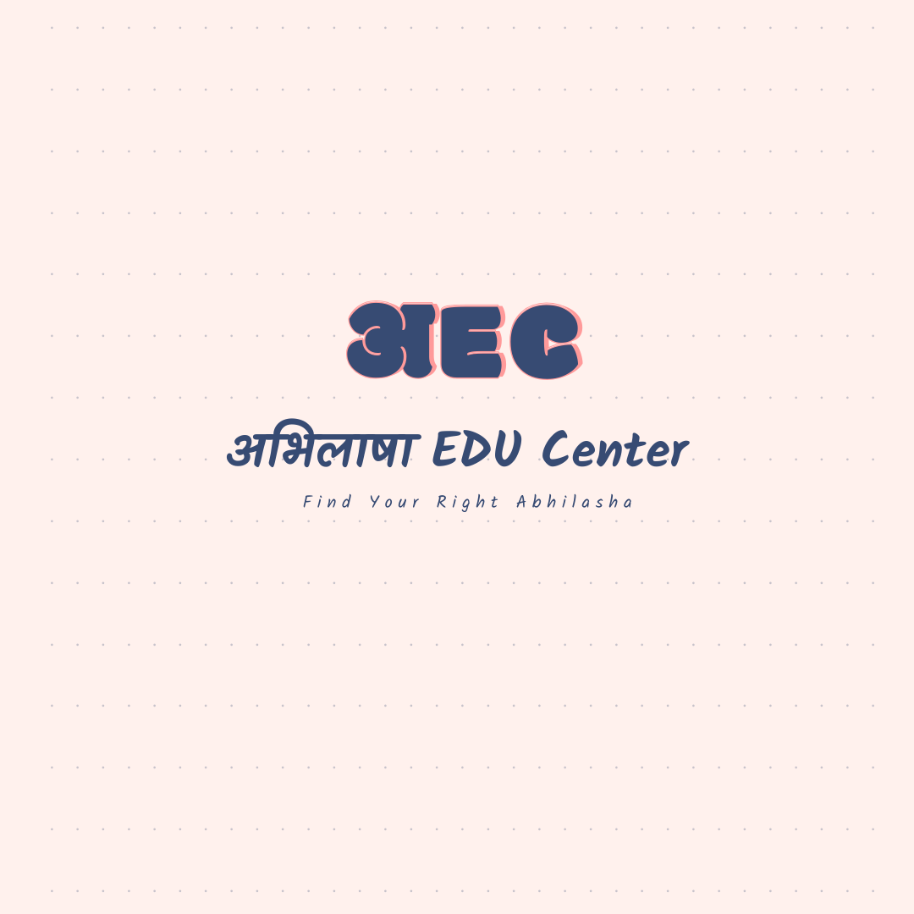

<h1 align="center"> Abhilasha EDU Center (अEC)</h1>

<h3><i>Free Education for All</i></h3>

### Contents:

### About Us:
Welcome to <b>Abhilasha EDU Center (अEC)</b>, your one-stop destination for free, high-quality education in Computer Science, Maths, Aritifical Intelligence, Machine Learning, Data Science, Coding, ,Technology and many more to follow! At अEC, we believe that education should be accessible to everyone, regardless of their background or financial resources. That's why we're dedicated to providing comprehensive and engaging learning experiences for learners of all ages and levels.

#### Our Mission:

Our mission is to empower learners with the knowledge and skills they need to succeed in today's technology-driven world. Whether you're a student, a professional looking to upskill, or someone simply curious to learn more, we're here to support you on your learning journey.

#### What We Offer:

- <b>Structured Learning</b>: Our content is carefully curated and structured to cover a wide range of Subjects from the Basics to Advanced Concepts. This is achieved by having a Single playlist for each topic where the initial videos are for beginners and as we move down the playlist we cover more advance concepts of that particular topic.

- <b>Detailed Explanations</b>: Each video is designed to provide clear and concise explanations of complex concepts, supplemented with examples, illustrations, and practical demonstrations.

- <b>Hands-on Practice</b>: We believe in the importance of hands-on practice. That's why we provide practical assignments, challenges, and project ideas to help you apply what you've learned and build real-world skills.

- <b>Interactive Community</b>: Join our vibrant community of learners from around the world! Engage with fellow learners, ask questions, share insights, and collaborate on projects in our comment sections and discussion forums.

#### Join Us:

Ready to embark on your learning journey? Subscribe to LearnTech and hit the notification bell to stay updated with our latest videos. Together, let's unlock the exciting world of technology and unleash your potential!

#### Connect With Us:

- Subscribe: 
- Website: [Your Website URL]
- Facebook: [Your Facebook Page]
- Twitter: [Your Twitter Handle]
- Instagram: [Your Instagram Handle]

### Topic:
- [ ] <b>Coding Tutorials</b>: Whether you're a beginner or an experienced coder, our coding tutorials will help you sharpen your skills in popular programming languages like Python, Java, C, C++, JavaScript, and more.
  - [x] Common Coding Concepts ( CCC ):
  - [ ] C Programming ( C ):
  - [ ] Python Programming ( Python ):
     

### Our Content:

Computer Science Curriculum: We cover a comprehensive range of topics in computer science, including programming languages, data structures, algorithms, software engineering, and more.

Specialized Tracks: Explore specialized tracks in areas such as web development, mobile app development, cybersecurity, artificial intelligence, and machine learning.

Exam Preparation: Prepare for school exams, college entrance exams, coding interviews, and certifications with our exam-focused tutorials and practice questions.

